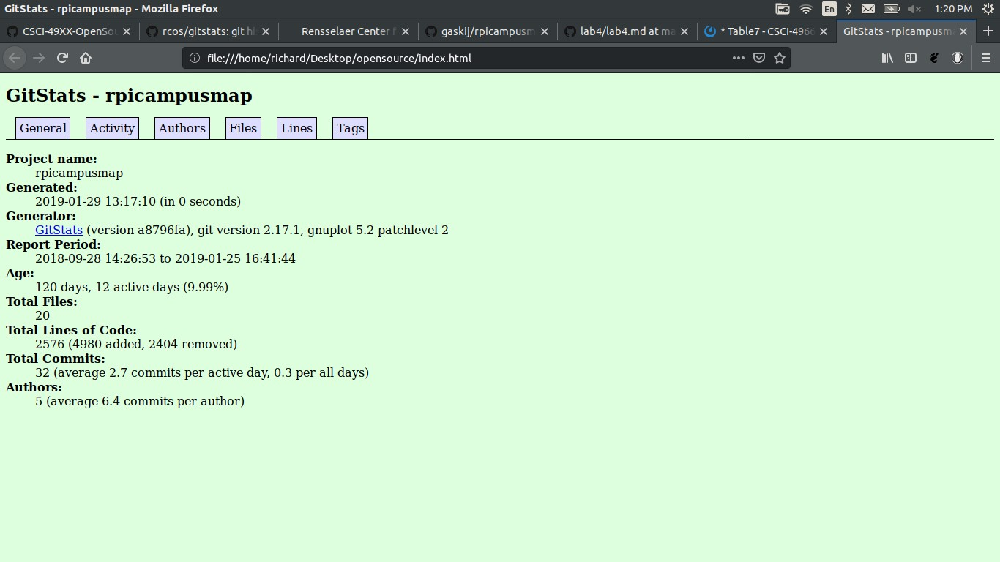
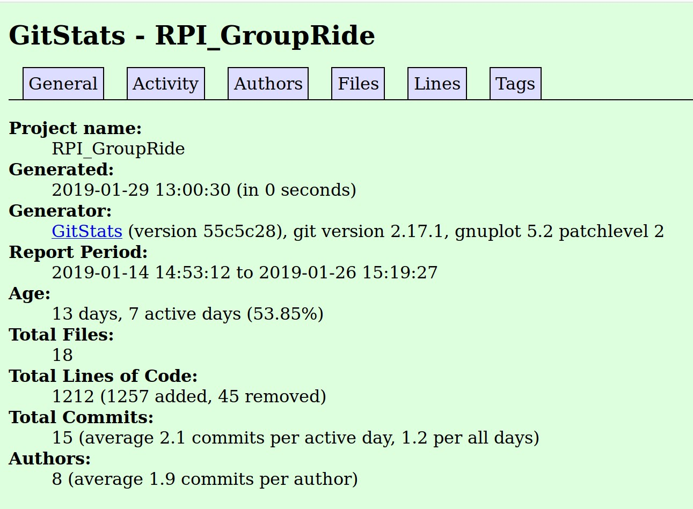
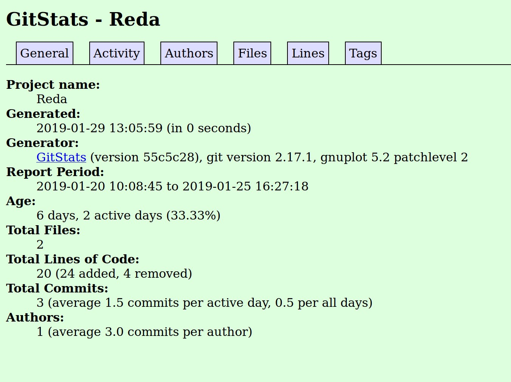
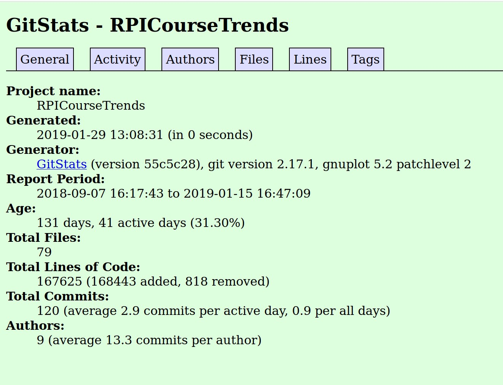
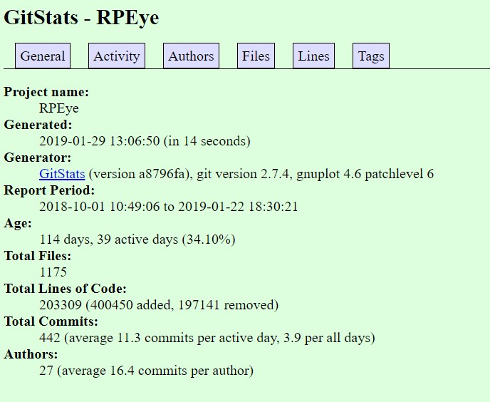

This is lab3.md  
##RPI Campus Map:  
4 contribs  
22309 lines  
first commit: sept 28, 2018  
Last commit Jan 25, 2019  
1 branch  
  

##RPI GroUber  
-Number of contributors: 6  
-Number of lines of code: 55 -First commit: 3214d376a89a3792311662c10291c9e31b197cfc (Jan 14, 2019)  
-Latest commit: 5c15fa6b6593210809cca45c5d10be3e3cfdcc5a (Jan 26, 2019)   
-Current branches: master, create-account, add-liscense-1  
  

##Reda  
-Number of contributors: 1  
-Codes: 20 lines  
First commit: 21d65dd33002a0364635b792a6c9bf490a7661c3 'Initial commit'  
12:45 PM  
Latest commit: 4daba655d5a2c2b88ecdbf576209b07283f0e19c 'Update LICENSE'  
Current branch: master  
  
 
##RPICourseTrends  
-Number of contributors: 5  
-Codes: 162112 lines  
First commit: a1e873f150f62158a074b5c784def0f87b186c9a 'Initial commit'  
Latest commit: ad8be1be0f286872b6a44928bbaf6b4d536f2ec9 'Update README.md'  
Current branch: master  
  

##RPEye Analysis  
Number of Contributors: 18  
Number of lines of code: 76224  
First commit: 91d45a2a945f4ee225c405d334f688561973b8ad Oct. 1, 2018  
Latest commit: f4d9c1db0415656d38a4dd3e39ed6b17578a5ec1 Jan. 22, 2019  
Current branches: master, Crawler, Indexing, Link-Analysis, Ranking, Text-Transformation, UI-UX  

